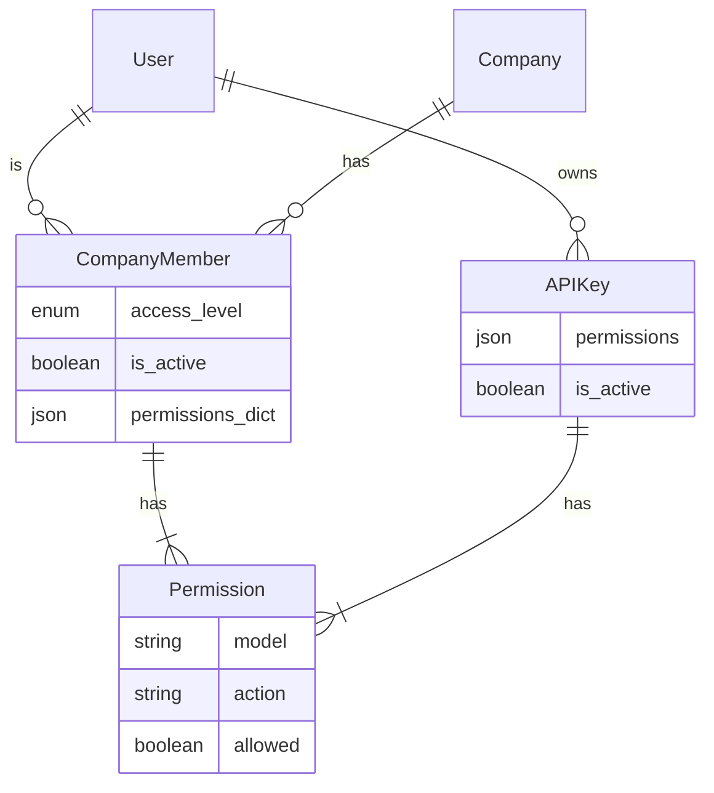
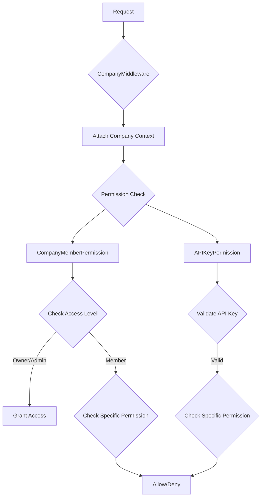

# Role-Based Access Control (RBAC) Implementation

## Overview

The RBAC system in Awecount provides a flexible and granular permission management system that operates at both the company and API level. The implementation follows a model-based permission approach where each model can define its own set of permissible actions.

## Core Components

### 1. Permission Definition

#### Model-Level Permissions

```python
class YourModel(models.Model):
    class PermissionsMeta:
        key = 'model_name'  # Optional, defaults to model name
        actions = ['view', 'create', 'modify', 'delete', 'custom_action']
```

The `get_default_permissions()` function dynamically generates permissions based on model definitions:

- Scans all registered Django models
- Looks for `PermissionsMeta` class
- Validates and normalizes permission actions
- Returns a structured permission dictionary

### 2. Permission Classes

#### CompanyMemberPermission

Handles company-level access control with the following features:

- Validates user authentication and company membership
- Automatic approval for OWNER and ADMIN access levels
- Maps HTTP methods and view actions to permission actions:
  - POST → create
  - GET → view
  - PUT/PATCH → modify
  - DELETE → delete

#### APIKeyPermission

Manages API-level access with:

- API key validation
- Permission checking based on model and action
- Safe method handling

### 3. Permission Resolution Logic

Both `CompanyMemberPermission` and `APIKeyPermission` share the same logic for resolving actions:

```python
DEFAULT_ACTION_MAPPING = {
    "create": "create",
    "list": "view",
    "retrieve": "view",
    "update": "modify",
    "partial_update": "modify",
    "destroy": "delete",
}

DEFAULT_METHOD_MAPPING = {
    "POST": "create",
    "GET": "view",
    "PUT": "modify",
    "PATCH": "modify",
    "DELETE": "delete",
}
```

The action resolution follows this order:

1. Check if view has an action attribute
2. If present, look up in `DEFAULT_ACTION_MAPPING`
3. If not found in mapping, use the action as is
4. If no view action, fall back to `DEFAULT_METHOD_MAPPING` using HTTP method

## Entity Relationship Diagram



## Permission Flow



## Implementation Details

### 1. Company Context

The `CompanyMiddleware` attaches company context to each request using `SimpleLazyObject` for efficient loading.

### 2. Permission Resolution

Permissions are resolved in the following order:

1. Authentication check
2. Company membership validation
3. Access level evaluation
4. Specific permission check based on:
   - Model name
   - Action type
   - User role/API key permissions

## Best Practices

1. **Model Permission Definition**
   - Use clear, lowercase action names
   - Define only necessary actions
   - Document custom actions

2. **Permission Checking**
   - Always use the permission classes for consistency
   - Implement custom permission classes by extending `BasePermission`
   - Cache permission results when appropriate

3. **API Key Usage**
   - Generate with limited scope
   - Regularly rotate keys
   - Monitor usage patterns

## TODO

1. **Custom Action Mapping**
   - Implement configurable mapping between viewset actions and permission actions
   - Example: Map `approve_transaction` viewset action to `approve` permission action
   - Add documentation for custom action mapping configuration
   - Consider caching strategies for mapping lookups

2. **Code Refactoring**
   - Abstract shared permission logic into a mixin or base class
   - Move action mapping logic out of permission classes
   - Create unified interface for permission checking

## Security Considerations

1. **Permission Inheritance**
   - Higher access levels (OWNER, ADMIN) automatically inherit all permissions
   - Regular members require explicit permission grants

2. **Safe Methods**
   - Non-GET safe methods are handled separately
   - Additional validation for state-changing operations

3. **Company Isolation**
   - Strict company context enforcement
   - Cross-company access prevention

## Contributing

When adding new features or models:

1. Define `PermissionsMeta` for new models requiring access control
2. Update permission mappings if adding custom actions
3. Add appropriate permission checks in views
4. Document any custom permission logic
5. Add tests covering permission scenarios
