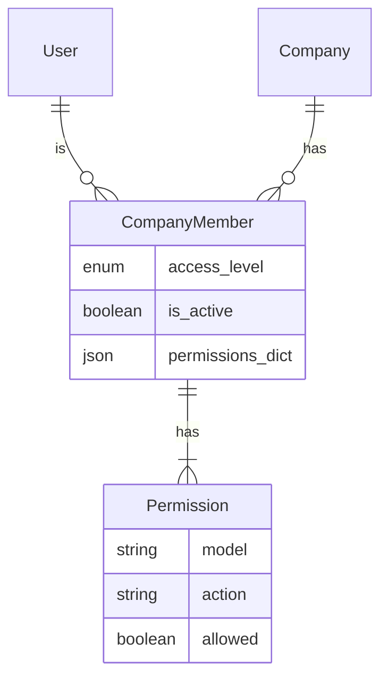
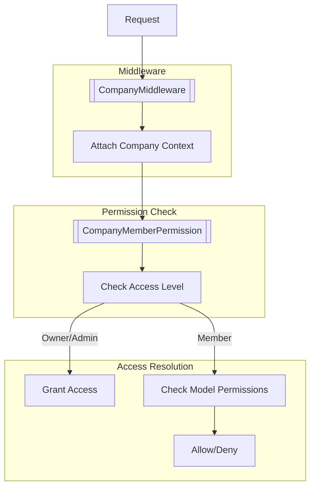

# Role-Based Access Control (RBAC) Implementation

## Overview

The RBAC system in Awecount provides a flexible and granular permission management system that operates at both the company and API level. The implementation follows a model-based permission approach where each model can define its own set of permissible actions.

## Core Components

### 1. Permission Definition

#### Model-Level Permissions

```python
class YourModel(models.Model):
    class PermissionsMeta:
        key = 'model_name'  # Optional, defaults to model name
        actions = ['read', 'create', 'update', 'delete', 'custom_action']
```

Models without `PermissionsMeta` automatically get all CRUD permissions:

```python
DEFAULT_CRUD_ACTIONS = {
    "read": True,
    "create": True,
    "update": True,
    "delete": True,
}
```

### 2. Permission Classes

#### CompanyMemberPermission

Handles company-level access control with the following features:

- Validates user authentication and company membership
- Automatic approval for OWNER and ADMIN access levels
- Maps HTTP methods and view actions to permission actions:
  - POST → create
  - GET → read
  - PUT/PATCH → update
  - DELETE → delete

### 3. Permission Resolution Logic

`CompanyMemberPermission` uses the following logic for resolving actions:

```python
DEFAULT_ACTION_MAPPING = {
    "create": "create",
    "list": "read",
    "retrieve": "read",
    "update": "update",
    "partial_update": "update",
    "destroy": "delete",
}

DEFAULT_METHOD_MAPPING = {
    "POST": "create",
    "GET": "read",
    "PUT": "update",
    "PATCH": "update",
    "DELETE": "delete",
}
```

The action resolution follows this order:

1. Check if view has an action attribute
2. If present, look up in `DEFAULT_ACTION_MAPPING`
3. If not found in mapping, use the action as is
4. If no view action, fall back to `DEFAULT_METHOD_MAPPING` using HTTP method

## Entity Relationship Diagram



## Permission Flow



## Implementation Details

### 1. Company Context

The `CompanyMiddleware` attaches company context to each request using `SimpleLazyObject` for efficient loading.

### 2. Permission Resolution

Permissions are resolved in the following order:

1. Authentication check
2. Company membership validation
3. Access level evaluation
4. Specific permission check based on:
   - Model name
   - Action type
   - User role

## TODO

1. **Custom Action Mapping**
   - Implement configurable mapping between viewset actions and permission actions
   - Example: Map `approve_transaction` viewset action to `approve` permission action
   - Add documentation for custom action mapping configuration
   - Consider caching strategies for mapping lookups

## Contributing

When adding new features or models:

1. By default, all models have CRUD permissions (read, create, update, delete)
2. Add `PermissionsMeta` only if you need custom actions or want to restrict default permissions
3. Add appropriate permission checks in views using `permission_classes = [CompanyMemberPermission]`
4. Document any custom actions in the model's `PermissionsMeta`
